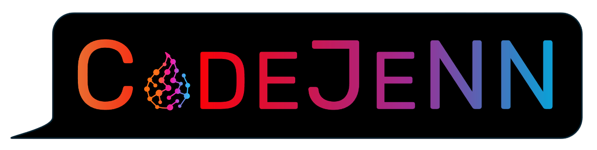

<!-- 
Distribution Statement A. Approved for public release, distribution is unlimited.
---
THIS SOURCE CODE IS UNDER THE CUSTODY AND ADMINISTRATION OF THE GOVERNMENT OF THE UNITED STATES OF AMERICA.
BY USING, MODIFYING, OR DISSEMINATING THIS SOURCE CODE, YOU ACCEPT THE TERMS AND CONDITIONS IN THE NRL OPEN LICENSE AGREEMENT.
USE, MODIFICATION, AND DISSEMINATION ARE PERMITTED ONLY IN ACCORDANCE WITH THE TERMS AND CONDITIONS OF THE NRL OPEN LICENSE AGREEMENT.
NO OTHER RIGHTS OR LICENSES ARE GRANTED. UNAUTHORIZED USE, SALE, CONVEYANCE, DISPOSITION, OR MODIFICATION OF THIS SOURCE CODE
MAY RESULT IN CIVIL PENALTIES AND/OR CRIMINAL PENALTIES UNDER 18 U.S.C. § 641.
-->



<div align="center">

__Distribution Statement A: Distribution Statement A. Approved for public release, distribution is unlimited.__
</div>

## Introduction

CodeJeNN is a neural network generator for C++ that ingests a trained neural network and enables on-the-fly inference within computational physics and fluid dynamics software. This approach eliminates the need for third-party machine learning libraries, which can be cumbersome and may require loading large dependencies into memory for prediction. Instead, the neural network is inlined as native C++ code and localized to the user’s machine for inference. This supports scalability and enables optimizations commonly sought in numerical solvers, such as faster constitutive laws, accurate interpolation functions, and reduced-order modeling.

CodeJeNN converts neural networks trained using the high-level deep learning (DL) API, **Keras**, into a C++ header file that can be directly integrated into the user’s code for prediction. Keras is not a deep learning library framework, it is a high-level API library that utilizes 3 backend frameworks, **TensorFlow**, **PyTorch**, or **JAX**, as specified by the user.

CodeJeNN is compatible with all backends supported by Keras, namely **TensorFlow**, **PyTorch**, and **JAX**, however, all tutorials are only written for **Pytorch** or **Tensorflow** backend.

## Directory Contents
```plaintext
CodeJeNN/

    └── src/
            └── api-core/
            └── bin/
            └── dump_model/
            └── clean.sh
            └── generate.sh
            └── readme.md
    └── tutorials/
            └── 01_simple_mlp/
            └── 02_cnn_1d/
            └── 03_cnn_2d/
            └── 04_cnn_3d/
            └── 05_advanced_mlp/
            └── 06_speed_test/
            └── 07_cfd_implementation/
            └── hdf5_file_breakdown.md
            └── supported_layers.md
    └── license.txt
    └── logo.png
    └── readme.md
    └── requirements.txt
```

## Starting Point

#### >>> The required Python version depends on the backend used. See this [website](https://keras.io/getting_started/) for more info.

#### >>> The recommended installer is `apt` for Linux users and `brew` for macOS users.

#### >>> You ONLY need the `src` directory, all other files are just auxillary but still very useful. <br>

####

1. First open up a terminal/shell session and clone this repo into the home "`~/`" directory:

    ```bash
    git clone https://github.com/jarcities/CodeJeNN.git ~/codejenn
    cd ~/codejenn
    ```

    or where ever you choose:
    
    ```bash
    git clone https://github.com/jarcities/CodeJeNN.git
    cd codejenn
    ```

1. You do not need to create a virtual environment, but it is best to use one. This allows all dependent packages to be in one spot. 

    The first way is by using conda which you can install from [Install Miniconda (official site)](https://www.anaconda.com/docs/getting-started/miniconda/install). Then in your terminal/shell, create a conda environment and activate it.

    ```bash
    conda create -n codejenn python="version_of_choice"
    conda activate codejenn
    ```

    OR

    The second way is to use a python environment by installing python using `sudo apt install python"version_of_choice"` or `brew install python@"version_of_choice"`. Then in your home directory create a **python_environments** directory and create an environtment in there and activate it.

    ```bash
    mkdir ~/python_environments/
    cd ~/python_environments/
    python"version_of_choice" -m venv codejenn
    source codejenn/bin/activate
    ```

    Where `codejenn` is the name of the environment.
    
1. Next, out of the 3, install which DL framework of choice (these all have different supported python versions):

    ```
    pip3 install tensorflow
    pip3 install torch torchvision
    pip3 install jax
    ```

1. Next install the necessary libraries which are common in most deep learning codes already.
    ```bash
    pip install -r requirements.txt
    ```
    
1. From here, `cd` into `src` and carry on with the <mark>***README.md***</mark> file in there.

    * Moreover, there are 7 different tutorials in `tutorials/` that contain their own <mark>***README.md***</mark>. Following those instructions will help with code generating a model and implementing it in your own applications.

## Citation
```
# WILL ADD SOON
```